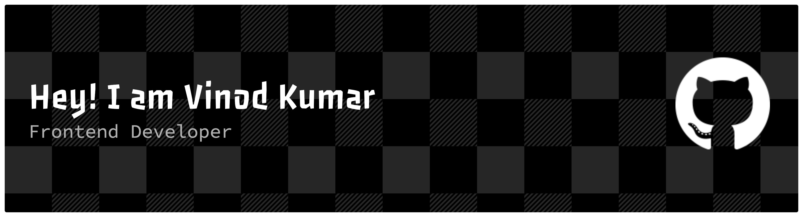

<!-- ========================================================= -->
<!--                       HERO SECTION                         -->
<!-- ========================================================= -->

 

 

---

#  Hello, I'm Vinod Kumar

### 💻 Frontend Developer

I enjoy creating clean, responsive and modern web applications
that provide a great user experience.

Currently improving my skills in **Java**, **Data Structures & Algorithms**
while exploring modern frontend technologies.

I believe great products are built with a balance of
beautiful design, performance and clean code.

 

### 🚀 Current Focus

- 🌱 Learning **Java**
- ⚡ Practicing **Data Structures & Algorithms**
- 💙 Exploring **React.js**
- 🎨 Improving **UI/UX Design**
- 💼 Looking for **Frontend Internship Opportunities**

---

# 🛠 Tech Arsenal

## 🌐 Frontend

  

## ☕

  

## ⚒ Tools

---

# 💡 What Drives Me

<table>
<tr>

<td width="50%">

### 🎯 Goals

- Build modern web applications
- Master React ecosystem
- Become strong in Java
- Solve DSA consistently
- Contribute to Open Source

</td>

<td width="50%">

### 💎 Strengths

- Responsive Design
- Clean UI
- Reusable Components
- Fast Learner
- Team Collaboration

</td>

</tr>
</table>

---

## ⚡ Developer Philosophy

> **"Good code solves problems. Great code creates experiences."**

---
